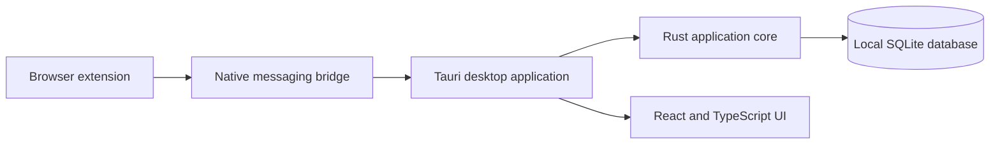

# eBay Sync

Desktop operations workspace for marketplace sellers, built with Claude Code.

> **Status:** active development. This public repository is a portfolio showcase; the production source code and operational configuration are private.

## Product

eBay Sync brings order management, supplier-order capture, tracking workflows and operational visibility into one Windows desktop application. The project is designed around explicit validation, durable local data and human review for sensitive marketplace actions.

## What it demonstrates

- Cross-platform desktop engineering with Tauri 2 and Rust
- React 19 + TypeScript interface built with Vite
- Chrome extension and native-messaging integration
- Local SQLite persistence, backup and restore workflows
- Tracking-number classification and state-machine foundations
- Automated tests with Vitest and Rust tests
- Italian and English localization
- Transparent documentation of unfinished features and technical limitations

## Architecture

## Development with Claude Code

Claude Code was used as an agentic development environment for architecture exploration, implementation, refactoring, testing and documentation. Requirements, product decisions, review of generated code and final validation remained human-controlled.

## Current scope

The project is intentionally presented as work in progress. Completed foundations include the desktop application, persistence layer, extension-to-desktop communication, supplier adapter framework and tracking pipeline. Real-account integrations and automated marketplace mutations remain gated behind manual verification.

## Intellectual property

Copyright © 2026 Claudia Garau. All rights reserved.

This repository contains documentation only. No license is granted to copy, redistribute or commercially exploit the private implementation, product identity or associated assets.

## Portfolio code samples

The `portfolio-review` branch includes small, runnable TypeScript excerpts and tests covering sync planning, idempotency and retry handling. Production adapters, account integrations and operational configuration remain private.
